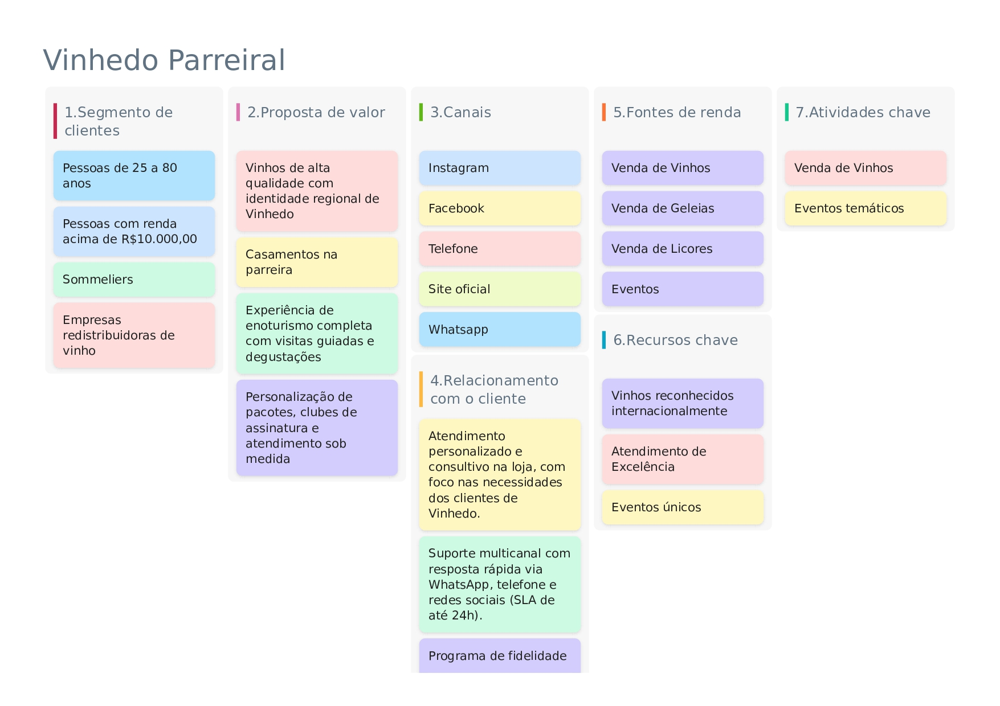
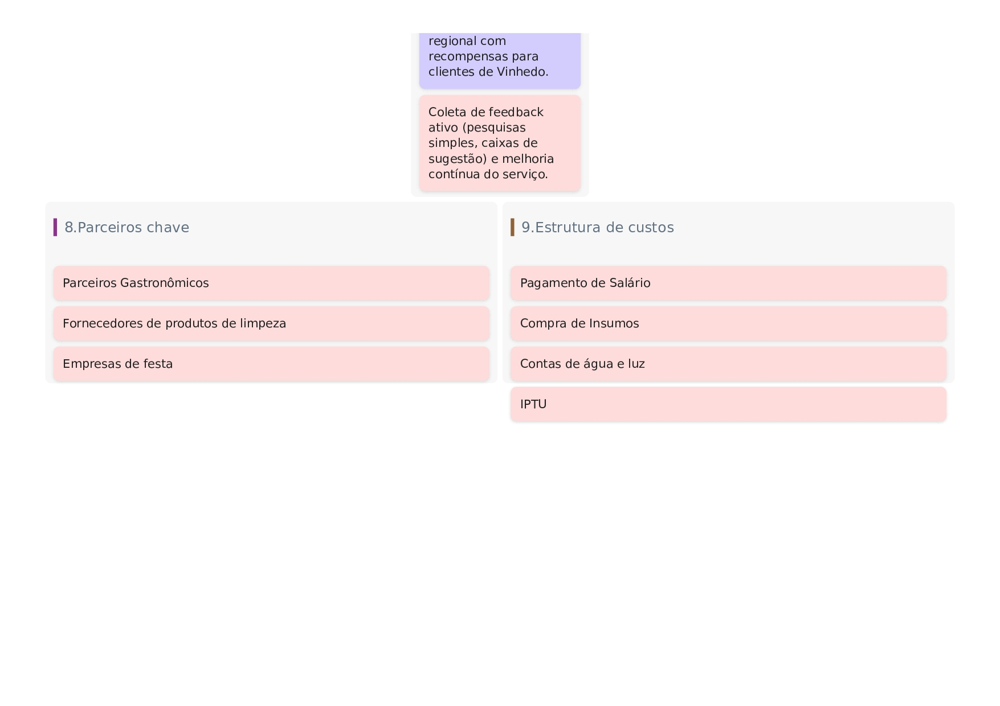

# 2\. Descrição do Projeto  
 

## 2.1 Visão Geral do Projeto 

O sistema Gestão Parreiral surge com uma proposta de união englobando tradição e inovação. Ele apoiará desde experiências turísticas, como visitas guiadas e degustações, até tarefas cotidianas como agendamentos, controle financeiro e relatórios estratégicos. 

### Suas principais funcionalidades incluem:

* Cadastro de clientes e produtos;  
* Controle de estoque com avisos automáticos;  
* Vendas;  
* Geração de nota fiscal eletrônica   
* Histórico de compras e área exclusiva para clientes;  
* Gerenciamento de promoções e organização de eventos.  
* 

## 2.1.1 Canvas do Projeto:

## 2.2 Stakeholders •

## • Equipe de Desenvolvimento:  
 Responsável por implementar o sistema, codificar as funcionalidades, realizar testes, ajustar integrações e garantir que o software funcione de forma estável e confiável.

## • Gerente de Projeto:  
 Coordena o planejamento geral, estabelece cronogramas, acompanha as etapas de desenvolvimento, prevê erros e assegura que as entregas estejam alinhadas com as necessidades do vinhedo e com o escopo definido.

## • Administradores do Vinhedo:  
 Usuários internos que cuidam do cadastro de clientes, gerenciamento financeiro, controle de reservas, registro de vendas, emissão de notas fiscais, organização de eventos e acompanhamento dos relatórios gerenciais.

## • Funcionários do Vinhedo:  
 Auxiliam nas rotinas operacionais, como atendimento ao público, confirmação de visitas, organização de degustações e suporte aos eventos turísticos e sazonais.

## • Clientes do Vinhedo:  
 Usuários finais que acessam o portal para comprar vinhos e derivados, consultar histórico de compras, realizar pagamentos, inscrever-se em eventos e agendar experiências turísticas como degustações e visitas guiadas.

## • Especialista de Domínio (Enólogo/Turismólogo):  
 Profissional que apoia a equipe de desenvolvimento na definição das regras específicas do negócio, como gestão de safras, padrões de degustação, dinâmica de eventos e características da operação do vinhedo.

## • Equipe de Suporte Técnico:  
 Responsável pela manutenção contínua após o lançamento, correção de falhas, monitoramento do sistema, atualizações e suporte aos administradores e usuários.

## • Parceiros Gastronômicos e Turísticos:  
 Restaurantes, guias, organizadores de eventos e serviços integrados que dependem do sistema para acessar informações, confirmar reservas ou validar a entrada em áreas restritas.

