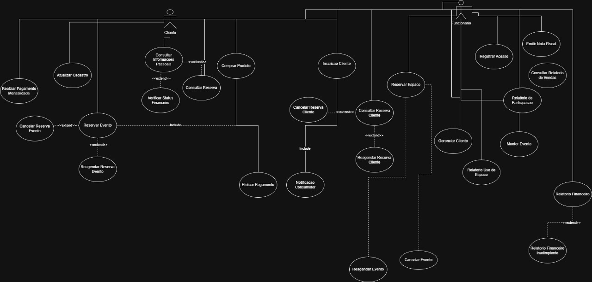

# 4\. Diagrama de Casos de Uso

# Caso de Uso 1: Realizar Compra de Vinhos ou Produtos do Vinhedo

**Ator Principal:** Cliente  
**Atores Secundários:**  
 • Sistema de Pagamento (PIX, cartão, PayPal)  
 • Administrador (apenas em compras presenciais)

**Objetivo:**  
 Permitir que o cliente compre vinhos, kits ou produtos derivados diretamente pelo sistema, gerando nota fiscal, atualizando o estoque e registrando toda a transação no histórico do cliente.

### **Pré-condições**

* O cliente deve estar cadastrado no sistema.

* O produto deve estar disponível em estoque ou permitir pré-reserva.

### **Pós-condições**

* A compra é registrada no sistema.

* O estoque é atualizado automaticamente.

* A nota fiscal é gerada e armazenada.

* O histórico do cliente é atualizado.

### **Fluxo Principal**

1. O cliente acessa o catálogo de vinhos e produtos.

2. O sistema exibe informações detalhadas do item (safra, tipo de uva, lote, descrição, preço e estoque).

3. O cliente adiciona o produto ao carrinho.

4. O cliente confirma os dados da compra.

5. O sistema calcula o valor total, aplicando promoções, descontos sazonais ou cupons, se houver.

6. O cliente escolhe a forma de pagamento.

7. O sistema processa o pagamento.

8. O sistema gera automaticamente a nota fiscal.

9. O estoque é atualizado conforme os itens adquiridos.

10. O sistema registra a compra no histórico do cliente.

11. O sistema exibe uma mensagem de sucesso.

### **Fluxos Alternativos**

**A1 – Produto indisponível:**  
 O sistema oferece a opção “Realizar Pré-Reserva”, garantindo prioridade quando o produto voltar ao estoque.

**A2 – Pagamento recusado:**  
 O sistema informa a falha e permite tentar novamente, alterar a forma de pagamento ou cancelar.

**A3 – Cupom inválido:**  
 O sistema informa que o cupom não pode ser aplicado e solicita outro código.

# Caso de Uso 2: Inscrever-se em Evento ou aula no vinhedo

**Ator Principal:** Cliente  
**Atores Secundários:** Administrador (responsável por criar e disponibilizar o evento)

**Objetivo:**  
 Permitir que o cliente visualize os eventos e experiências disponíveis — como degustações, jantares harmonizados, visitas guiadas ou festivais sazonais — e realize a inscrição.

**Pré-condições**

* O cliente deve estar cadastrado no sistema.

* O evento deve estar cadastrado e habilitado para inscrições.

* Devem existir vagas disponíveis.

### **Pós-condições**

* A inscrição é registrada no sistema.

* O cliente passa a constar na lista de participantes daquele evento.

### **Fluxo Principal**

1. O cliente acessa a área de eventos e experiências.

2. O sistema lista todos os eventos cadastrados, com data, horário, descrição, preço e vagas.

3. O cliente seleciona um evento.

4. O sistema exibe os detalhes, incluindo regras, limite de participantes e informações adicionais.

5. O cliente solicita inscrição.

6. O sistema verifica se ainda há vagas.

7. O sistema registra a inscrição.

8. O sistema confirma a inscrição ao cliente e disponibiliza comprovante.

### Fluxos Alternativos

**A1 – Evento sem vagas:**  
 O sistema informa que não há mais vagas e impede a inscrição.

**A2 – Evento expirado ou já realizado:**  
 O sistema exibe aviso e não permite inscrições.

**A3 – Inscrição duplicada:**  
 O sistema identifica que o cliente já está inscrito e bloqueia nova inscrição.

**A4 – Promoções de evento (caso extend):**  
 O sistema pode oferecer descontos (ex.: “cliente fidelizado ganha 10%”) antes da confirmação da inscrição.

