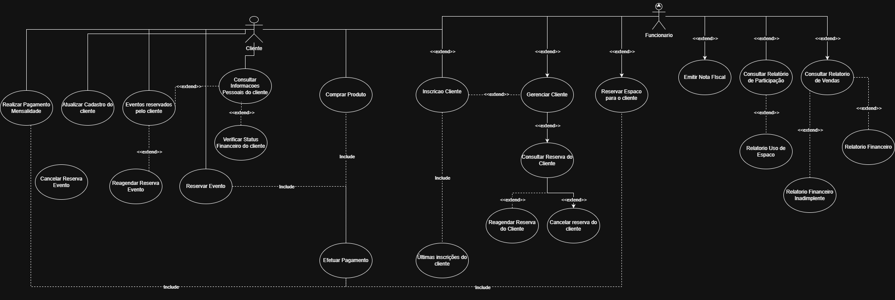

# 4\. Diagrama de Casos de Uso

Caso de Uso 1 – Efetuar Compra de Vinhos e Produtos do Vinhedo

## Ator Principal: Cliente
## Atores Secundários:

### Mecanismo de Pagamento (PIX, cartão, PayPal)

## Administrador (somente em vendas presenciais)

## Objetivo

Possibilitar que o cliente adquira vinhos, kits ou qualquer item produzido no vinhedo através do sistema, garantindo a emissão da nota fiscal, atualização do estoque e registro completo da operação no histórico do cliente.

## Pré-condições

O cliente precisa ter cadastro ativo no sistema.

O produto deve possuir unidades disponíveis ou permitir reserva antecipada.

## Pós-condições

A compra é registrada com sucesso.

O estoque é automaticamente reduzido conforme os itens adquiridos.

A nota fiscal é emitida e armazenada pelo sistema.

O histórico do cliente é atualizado com a nova transação.

## Fluxo Principal

O cliente acessa o catálogo de produtos do vinhedo.

O sistema apresenta os detalhes do item (safra, uva, lote, descrição, valor e disponibilidade).

O cliente coloca o item escolhido no carrinho.

O cliente revisa e confirma as informações do pedido.

O sistema calcula o valor final, considerando promoções, cupons ou descontos.

O cliente seleciona a forma de pagamento desejada.

O sistema realiza o processamento do pagamento.

A nota fiscal é gerada automaticamente.

O estoque é atualizado de acordo com os produtos comprados.

A transação é registrada no histórico do cliente.

O sistema apresenta uma confirmação de compra bem-sucedida.

## Fluxos Alternativos

A1 – Produto esgotado:
O sistema oferece a opção de “Pré-Reserva”, garantindo prioridade quando o estoque for reabastecido.

A2 – Pagamento não autorizado:
O sistema informa a falha e permite tentar novamente, escolher outro método ou cancelar a operação.

A3 – Cupom inválido:
O sistema avisa que o cupom não é aceito e solicita um novo.

 Caso de Uso 2 – Inscrever-se em Evento ou Aula no Vinhedo

## Ator Principal: Cliente
Atores Secundários: Administrador (que cria, configura e habilita os eventos)

### Objetivo

Permitir que o cliente visualize todas as experiências disponíveis — como degustações, jantares harmonizados, tours guiados e festivais — e realize sua inscrição diretamente pelo sistema.

## Pré-condições

O cliente deve possuir cadastro.

O evento precisa estar cadastrado e aberto para inscrições.

Devem existir vagas disponíveis no momento da solicitação.

## Pós-condições

A inscrição do cliente é registrada no sistema.

O cliente passa a integrar a lista oficial de participantes.

## Fluxo Principal

O cliente acessa a seção destinada a eventos e experiências.

O sistema exibe todos os eventos, com data, horário, descrição, preço e número de vagas.

O cliente escolhe um evento.

O sistema mostra os detalhes completos, incluindo regras e limite de participantes.

O cliente solicita sua inscrição.

O sistema verifica disponibilidade de vagas.

O sistema realiza o registro da inscrição.

O cliente recebe a confirmação e o comprovante de participação.

## Fluxos Alternativos

A1 – Evento sem vagas:
O sistema informa a indisponibilidade e impede novas inscrições.

A2 – Evento expirado ou já ocorrido:
O sistema notifica o cliente e bloqueia a inscrição.

A3 – Inscrição repetida:
Se o cliente já estiver inscrito, o sistema impede nova inscrição.

A4 – Aplicação de descontos (caso extend):
Antes da finalização, o sistema pode aplicar promoções especiais, como desconto para clientes fidelizados.

