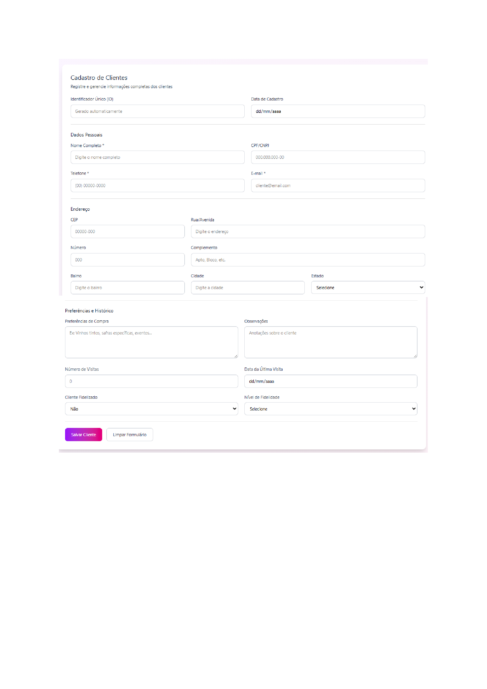
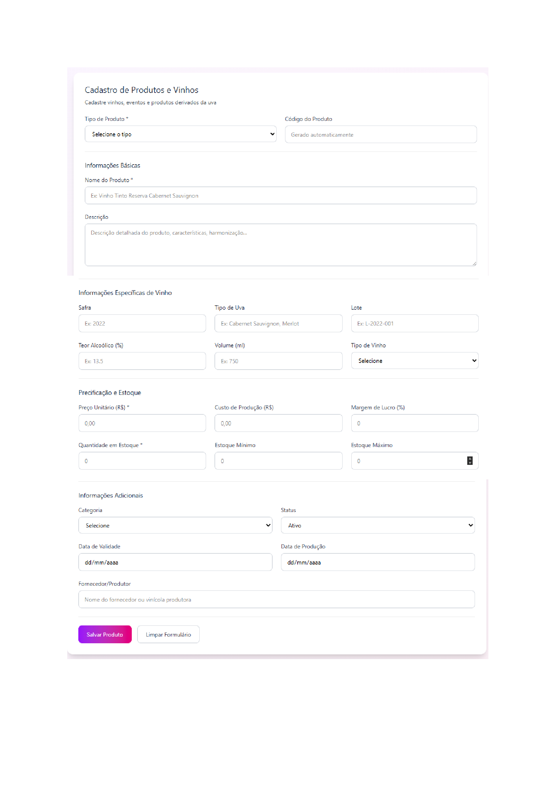
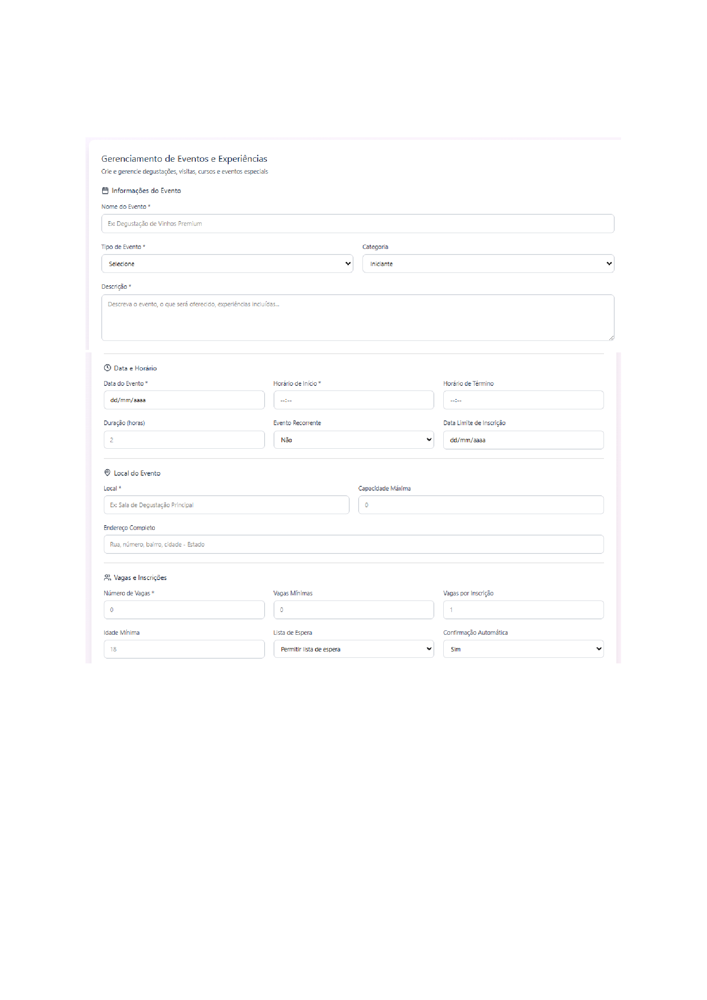
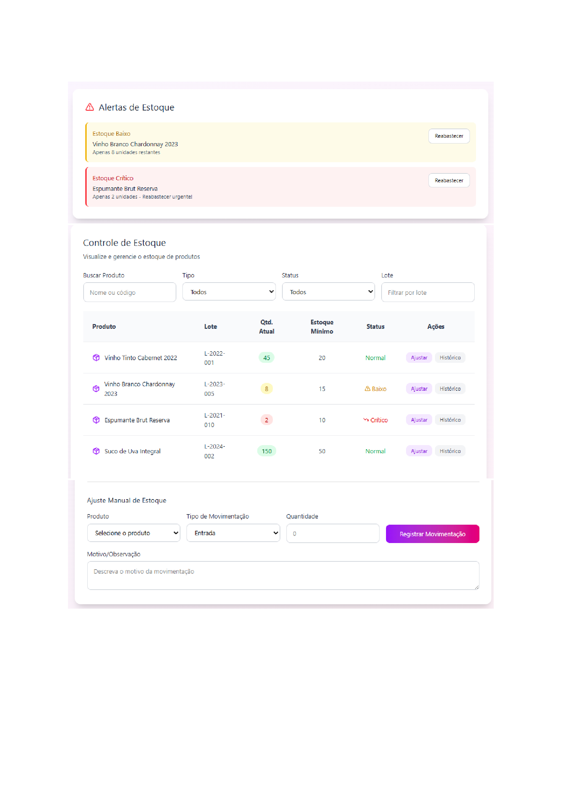

# 6\. Protótipo de Telas

## 6.1 Tela de Login

Tela inicial destinada ao acesso de clientes, administradores e colaboradores internos. Permite autenticação segura e direciona cada perfil para suas respectivas áreas do sistema.

## 6.2 Página Inicial (Home)

Apresenta uma visão geral do vinhedo, com destaque para os produtos da safra atual, eventos abertos para inscrição e experiências disponíveis, como degustações e visitas guiadas. A home também traz banners sazonais, como festivais da colheita ou promoções especiais.

## 6.3 Catálogo de Vinhos e Produtos

Mostra toda a linha de produtos do Vinhedo Parreiral: vinhos, kits, espumantes, itens artesanais e produtos exclusivos por safra. Cada cartão exibe informações essenciais — tipo, safra, preço e disponibilidade — além das opções de compra ou reserva.

## 6.4 Agenda de Eventos e Experiências

Espaço dedicado às atividades promovidas pelo vinhedo, incluindo degustações guiadas, visitas aos parreirais, jantares harmonizados, festivais e eventos sazonais. O usuário visualiza datas, vagas disponíveis, valores e pode realizar a inscrição diretamente.

## 6.5 Sobre o Vinhedo

Tela com informações institucionais sobre a história do Vinhedo Parreiral, sua missão, visão, cuidados com a produção, compromisso com a sustentabilidade e destaque para o processo artesanal de fabricação. O objetivo é aproximar o cliente da identidade e dos valores do vinhedo.

